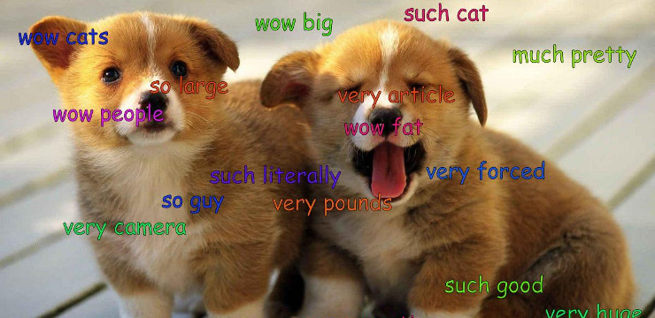

# This repository has been moved to [gitlab.com/paul-nechifor/auto-doge](http://gitlab.com/paul-nechifor/auto-doge).

Old readme:

# Auto Doge

A Reddit bot that creates Doge images. I ran it on [/u/auto-doge][bot]. It was a
complete and utter failure.

## Install

Install the script's dependencies:

     pip install cython # Need this first.
     pip install -r requirements.txt

## Configure

Copy the sample configuration:

    cp config-sample.yaml config.yaml

Change the necessary fields as described in the config file.

## Run

    python2 bot.py

## License

MIT

[bot]: http://www.reddit.com/user/auto-doge
